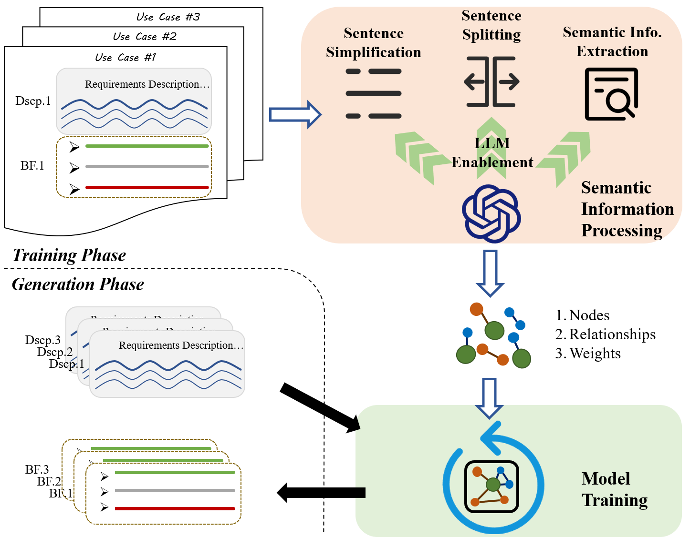

# BasicFlowGeneration
This repository contains the implementation and evaluation program for our paper "BFGen: Basic Flow Generation for Use Cases via LLM and Relational Graph Attention Networks".

Identifying interaction scenarios between a system and its actors from the high-level requirements and forming use case basic flows is crucial in requirement refinement. Traditional manual methods often yield incomplete or inaccurate flows due to engineers' limited domain expertise, while rule-based methods—relying on predefined parsing rules—suffer from linguistic ambiguities and domain-dependent limitations. Although large language model (LLM) approaches leverage rich domain knowledge and robust natural language processing, they are constrained by input length, generation instability, and the risk of out-of-system outputs, frequently resulting in context-unaware or irrelevant flows. To overcome these challenges, this paper proposes BFGen to generate context-compliant basic flows strictly adhering to domain constraints and requirement boundaries. BFGen employs LLMs to accurately extract domain-specific terms and interactions, and it integrates an enhanced Relational Graph Attention Network with attention preservation factors to model logical dependencies and domain constraints effectively. Empirical evaluations on 13 public and 7 industrial datasets show that BFGen outperforms leading baselines by ≈14\% (Precision), ≈7-25\% (Recall), ≈11-30\% (F1 Score), and ≈10-19\% (AUC). Furthermore, our evaluations confirmed the effectiveness of both the LLM module and the attention preservation factors, as well as the robustness of BFGen.  
  

## Code Structure  
The code is stored in the folder `1_src`, including the BFGen algorithm, models, and experimental code involved in RQ1 , RQ2, RQ3, and RQ4.  

├── 0_dataset    
│   ├── 0_pub_dataset    
│   │   ├── 0_origin    
│   │   ├── 1_translated  
│   │   │   ├── uc_SMOS_en.json  
│   │   │   └── uc_eANCI_en.json  
│   │   └── 2_processed  
│   │       ├── uc_SMOS_en.json  
│   │       ├── uc_eANCI_en.json  
│   │       ├── uc_easyClinic.json  
│   │       ├── uc_iTrust.json  
│   │       ├── uc_keepass.json  
│   │       └── uc_pub_8in1.json  
│   ├── 1_industrial_dataset  
│   │   ├── 0_origin  
│   │   │   ├── README.md  
│   │   │   └── example.txt  
│   │   └── 1_processed  
│   │       ├── README.md  
│   │       └── example.json  
│   ├── 2_experiment_dataset  
│   └── README.md  
├── 1_src  
│   ├── 0_baseline_in_RQ1  
│   │   ├── 0_rule-based_method  
│   │   │   ├── 0_for_NCE-T_dataset.py  
│   │   │   └── 1_for_pub_dataset.py  
│   │   ├── 2_LLM_methods  
│   │   │   ├── 0_ERNIE_for_NCET.py  
│   │   │   ├── 1_ERNIE_for_pub.py  
│   │   │   └── 2_ERNIE_for_pub.py  
│   │   └── 3_R-GAT_with_BERT  
│   │       ├── 0_for_NCET.py  
│   │       └── 1_for_pub.py  
│   ├── 1_BFGen  
│   │   ├── 0_for_pub  
│   │   │   ├── 0_SIP  
│   │   │   │   ├── 0_preprocessing.py  
│   │   │   │   └── 1_extract_node.py  
│   │   │   ├── 1_enhanced_RGAT  
│   │   │   │   ├── 0_ERNIE_pub.py  
│   │   │   │   ├── 0_GPT_pub.py  
│   │   │   │   ├── 1_train_on_pub.py  
│   │   │   │   └── RGAT_model.py  
│   │   │   └── README.md  
│   │   └── 1_for_industrial  
│   │       ├── 0_ERNIE_NCET.py  
│   │       ├── 2_train_on_NCET.py  
│   │       └── README.md  
│   └── README.md  
├── 2_figure  
│   ├── Heterogeneous_Graph.png  
│   ├── RQ2-P1.png  
│   ├── RQ2-P2.png  
│   ├── RQ3-lambda.png  
│   ├── RQ4-P1.png  
│   ├── pipeline.png  
│   └── prompt.png  
├── LICENSE  
└── README.md  

## Datasets
The datasets are stored in the folder `0_datasets`, include:
- `0_datasets/0_pub_dataset`: the public datasets.
- `0_datasets/1_industrial_dataset`: the industrial datasets.
- `0_datasets/2_experiment_dataset`  are files involved in the author's execution of the code and are related to the code. There may be partially duplication with the first two files.

## figure
The figures of the paper are stored in the folder `2_figure`.